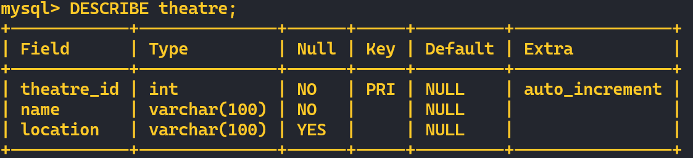
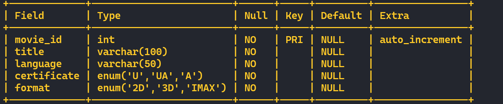
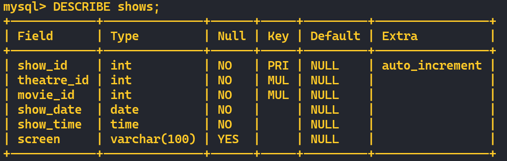
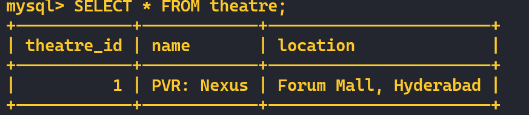
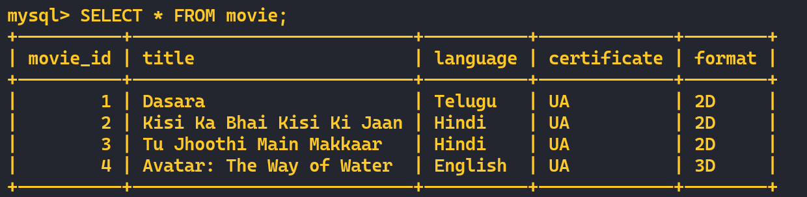
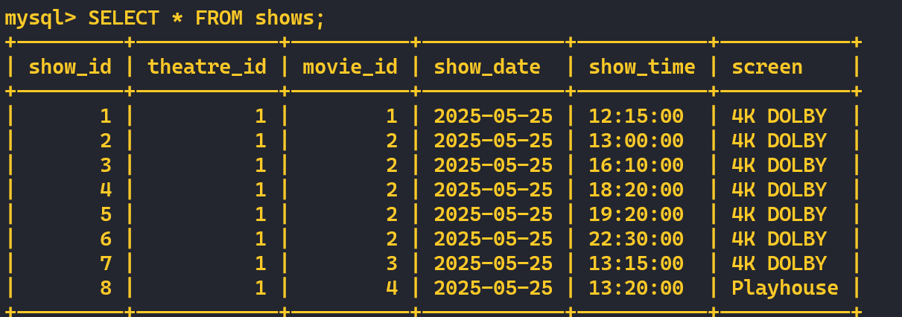
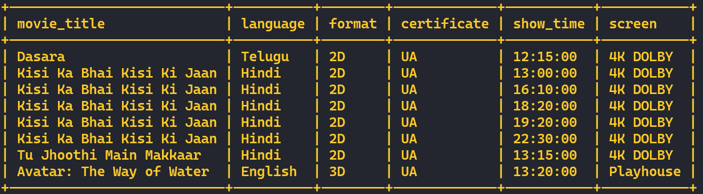

# Assignment

### **P1: Data Modeling**

#### **Entities and Attributes**

1. **Theatre**
   * `theatre_id` (PK)
   * `name`
   * `location`

2. **Movie**
   * `movie_id` (PK)
   * `title`
   * `language`
   * `certificate`
   * `format`

3. **Shows**
   * `show_id` (PK)
   * `theatre_id` (FK)
   * `movie_id` (FK)
   * `show_date`
   * `show_time`
   * `screen`

---

### **P1: MySQL Tables**

```sql
CREATE TABLE theatre (
    theatre_id INT PRIMARY KEY AUTO_INCREMENT,
    name VARCHAR(100) NOT NULL,
    location VARCHAR(100)
);
```


---

```sql
CREATE TABLE movie (
    movie_id INT PRIMARY KEY AUTO_INCREMENT,
    title VARCHAR(100) NOT NULL,
    language VARCHAR(50) NOT NULL,
    certificate ENUM('U', 'UA', 'A') NOT NULL,
    format ENUM('2D', '3D', 'IMAX') NOT NULL
);
```


---

```sql
CREATE TABLE shows (
    show_id INT PRIMARY KEY AUTO_INCREMENT,
    theatre_id INT NOT NULL,
    movie_id INT NOT NULL,
    show_date DATE NOT NULL,
    show_time TIME NOT NULL,
    screen VARCHAR(100),
    FOREIGN KEY (theatre_id) REFERENCES theatre(theatre_id),
    FOREIGN KEY (movie_id) REFERENCES movie(movie_id)
);
```



---

### Sample Data

```sql
INSERT INTO theatre (name, location) VALUES
('PVR: Nexus', 'Forum Mall, Hyderabad');
```


---

```sql
INSERT INTO movie (title, language, certificate, format) VALUES
('Dasara', 'Telugu', 'UA', '2D'),
('Kisi Ka Bhai Kisi Ki Jaan', 'Hindi', 'UA', '2D'),
('Tu Jhoothi Main Makkaar', 'Hindi', 'UA', '2D'),
('Avatar: The Way of Water', 'English', 'UA', '3D');
```


---

```sql
INSERT INTO shows (theatre_id, movie_id, show_date, show_time, screen) VALUES
(1, 1, '2025-05-25', '12:15:00', '4K DOLBY'),
(1, 2, '2025-05-25', '13:00:00', '4K DOLBY'),
(1, 2, '2025-05-25', '16:10:00', '4K DOLBY'),
(1, 2, '2025-05-25', '18:20:00', '4K DOLBY'),
(1, 2, '2025-05-25', '19:20:00', '4K DOLBY'),
(1, 2, '2025-05-25', '22:30:00', '4K DOLBY'),
(1, 3, '2025-05-25', '13:15:00', '4K DOLBY'),
(1, 4, '2025-05-25', '13:20:00', 'Playhouse');
```


---

### **P2: Query to List All Shows on a Given Date at a Given Theatre**

```sql
SELECT 
    m.title AS movie_title,
    m.language,
    m.format,
    m.certificate,
    s.show_time,
    s.screen
FROM shows s
JOIN movie m ON s.movie_id = m.movie_id
JOIN theatre t ON s.theatre_id = t.theatre_id
WHERE s.show_date = '2025-05-25'
  AND t.name = 'PVR: Nexus';
```


